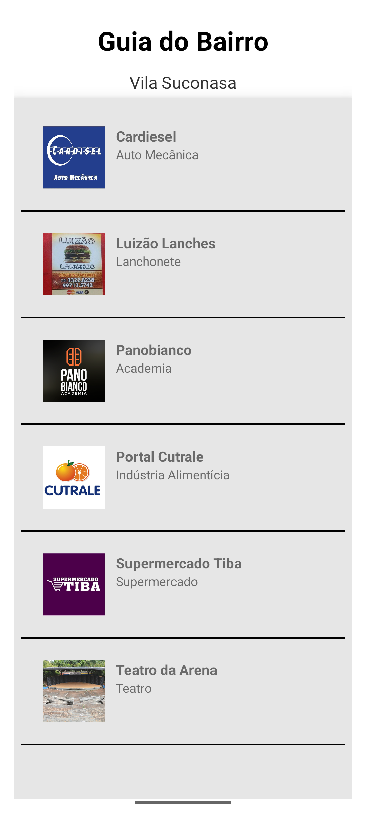
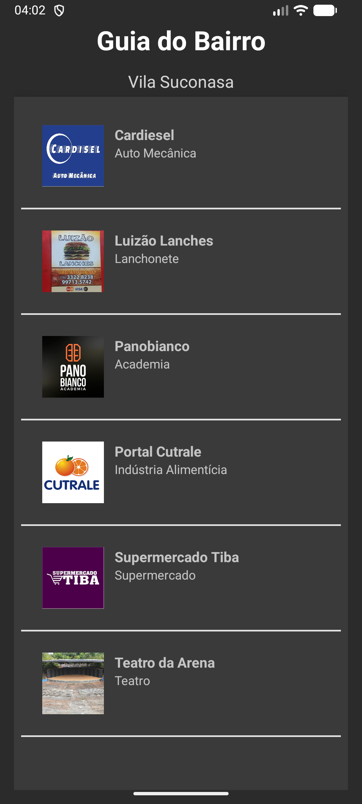

# Guia Pocket

**Disciplina:** ARQDMO1 - Dispositivos Móveis 1
**Professor:** Henrique Galati
**Instituição:** IFSP - Campus Araraquara
**Curso:** Análise e Desenvolvimento de Sistemas

---

## Descrição do Projeto

O **Guia Pocket** é um aplicativo móvel desenvolvido para divulgar pequenos serviços e comércios locais do bairro, como lanchonetes, academias, oficinas e supermercados.

O app permite ao usuário:

* Consultar uma lista fixa de estabelecimentos;
* Visualizar detalhes de cada serviço;
* Acionar funcionalidades nativas do dispositivo, como fazer ligação ou abrir o endereço no Google Maps;
* Adaptar-se ao modo claro/escuro do sistema;
* Suportar múltiplos idiomas (Português e Inglês).

O projeto foi inteiramente implementado em **Kotlin**, utilizando **Android Studio**, com as seguintes tecnologias e conceitos:

* **ViewBinding** para acesso seguro aos elementos de interface;
* **ListView** com Adapter personalizado;
* **Intents explícitas e implícitas**;
* **Internacionalização** (i18n);
* **Modo claro e escuro** com cores e temas configuráveis.

---

## Requisitos Funcionais Atendidos

### 1. Lista de Serviços

* **[RF1-1]** A tela principal exibe uma ListView com ao menos 6 serviços cadastrados.
* **[RF1-2]** Cada item mostra uma imagem, nome do serviço e categoria, usando layout personalizado.
* **[RF1-3]** O toque em um item abre uma nova Activity com detalhes do serviço selecionado via **Intent explícita**.

### 2. Funcionalidades com Intents Implícitas

* **[RF2-1]** Na tela de detalhes, é possível:

  * Realizar uma ligação telefônica para o estabelecimento;
  * Abrir o endereço no Google Maps.

### 3. Internacionalização e Modo Noturno

* **[RF3-1]** Suporte a dois idiomas: português (pt-BR) e inglês (en). O idioma é detectado automaticamente com base no sistema do usuário.
* **[RF3-2]** O app respeita o tema do sistema (claro/escuro), utilizando **themes.xml** e **colors.xml** para definir cores semânticas.

---

## Requisitos Não Funcionais Atendidos

* **[RNF1]** Desenvolvido em Kotlin, utilizando **ViewBinding** em todas as telas.
* **[RNF2]** Dados mantidos em memória, não persistidos.
* **[RNF3]** Código organizado seguindo boas práticas.
* **[RNF4]** Todos os textos armazenados em **strings.xml** com nomes semânticos.
* **[RNF5]** Cores e temas armazenados em **colors.xml** e **themes.xml** com nomes semânticos.

---

## Estrutura do Projeto

```
GuiaPocket/
├─ app/
│  ├─ src/main/
│  │  ├─ java/com/milan/pocketguide/ui/      # Activities
│  │  ├─ java/com/milan/pocketguide/adapter/ # Adapters
│  │  ├─ java/com/milan/pocketguide/model/   # Modelos de dados
│  │  ├─ res/                               # Recursos
│  │  │  ├─ layout/                          # Layouts XML
│  │  │  ├─ values/                           # colors.xml, strings.xml (en)
│  │  │  ├─ values-pt-rBR/                   # strings.xml (pt-BR)
│  │  │  ├─ drawable/                         # Imagens
```

---

## Funcionalidades

1. **Tela principal:** Lista de serviços com imagem, nome e categoria.
2. **Detalhes do serviço:**

   * Nome, categoria, endereço, telefone, website e imagem.
   * Botões para ligar, abrir mapa e voltar.
3. **Internacionalização:** Idioma detectado automaticamente.
4. **Modo claro/escuro:** Tema respeita configuração do sistema.

---

## Capturas de Tela

### Modo Claro


### Modo Escuro


### Comparação entre Modo Claro e Escuro

| Modo Claro                           | Modo Escuro                          |
| ------------------------------------ | ------------------------------------ |
|  |  |

### Idioma Português


### Idioma Inglês


---

## Tecnologias Utilizadas

* **Kotlin**
* **Android Studio**
* **ViewBinding**
* **ListView com Adapter personalizado**
* **Intents explícitas e implícitas**
* **Internationalization (i18n)**
* **Modo claro/escuro (Themes)**

---

## Como Executar

1. Clone o repositório:

```bash
git clone https://github.com/neverevis/PocketGuide
```

2. Abra o projeto no **Android Studio**.
3. Conecte um dispositivo ou emulador.
4. Clique em **Run** para instalar e executar o app.
